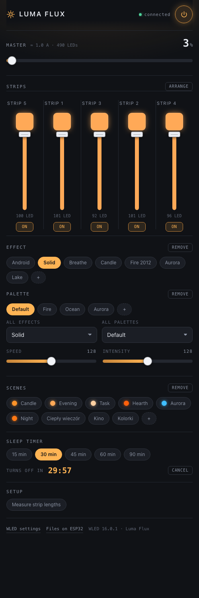

# Luma Flux

Sterowanie lampką na ESP32 z [WLED](https://kno.wled.ge/), z własnym
interfejsem zamiast wbudowanego panelu: jeden suwak na taśmę, każdy świecący
realnym kolorem swojej taśmy.



Powstało do lampki z pięcioma taśmami WS2812B na pięciu pinach GPIO, ale nic nie
jest przypisane na sztywno do piątki — wszystko wynika z tego, co zgłasza
płytka, więc dwie taśmy albo osiem działają tak samo.

*[English version](README.md) · [angielski interfejs](index.htm)*

## Czego potrzebujesz

- Płytki ESP32 (zwykły ESP32-WROOM z 4 MB flasha, sprzedawany jako
  „ESP32 DevKit")
- Taśm adresowalnych: WS2812B, SK6812 albo podobnych
- Zasilacza 5 V dobranego do taśm — patrz [Zasilanie](#zasilanie), to jest ta
  część, którą najczęściej się psuje
- Komputera i kabla USB, który przesyła dane (wiele kabli do ładowania nie)

## Uruchomienie

**1. Wgraj WLED na płytkę.** Podłącz ESP32 do USB i uruchom:

```sh
./install.sh
```

Skrypt znajdzie płytkę, pobierze WLED i całą resztę, po czym wszystko zapisze.
Przed skasowaniem czegokolwiek pyta o zgodę. Jeśli brakuje `esptool`, powie jak
go zainstalować.

**2. Podaj mu swoje Wi-Fi.** Płytka rozgłasza teraz własną sieć **WLED-AP**,
hasło `wled1234`. Połącz się z nią telefonem, otwórz `http://4.3.2.1`, wpisz
swoje domowe Wi-Fi i zapisz. Płytka się zrestartuje i dołączy do Twojej sieci.
Przydzielony adres znajdziesz na liście urządzeń w routerze.

**3. Skonfiguruj taśmy i wgraj interfejs:**

```sh
./deploy.sh <adres-z-kroku-2>
```

Potem otwórz ten adres w przeglądarce. To jest lampka.

Nie wiesz, ile diod ma która taśma? Nie musisz — patrz
[Pomiar](#pomiar-taśmy-o-nieznanej-długości).

## Podłączenie

Do danych nadaje się każdy wolny GPIO. Te pięć omija piny, które sprawiają
kłopoty — flash (6–11), piny startowe (0, 2, 12, 15), UART (1, 3) i wejścia bez
wyjścia (34–39):

| Taśma | GPIO |
|---|---|
| 1 | 16 |
| 2 | 17 |
| 3 | 18 |
| 4 | 19 |
| 5 | 23 |

GPIO 21 i 22 zostają wolne, gdyby doszedł czujnik I²C albo enkoder obrotowy.

## Zasilanie

Pojedyncza dioda WS2812B na pełnej bieli bierze około **60 mA**. Pięćset diod to
30 A. To jest ta liczba, która zaskakuje.

WLED ma ogranicznik prądu: mówisz mu, ile daje Twój zasilacz, a on przycina
jasność, żeby się w tym zmieścić. `deploy.sh` go ustawia — ustaw go zgodnie
z rzeczywistym zasilaczem, nie wyżej.

Reszta, mniej więcej w kolejności tego, jak często boli:

- **Masa zasilacza i masa ESP32 muszą być połączone.** Bez wspólnej masy linia
  danych nie ma odniesienia i taśmy migoczą losowo. To najczęstszy błąd
  w podłączeniu.
- **Nigdy nie zasilaj taśm z pinu 5 V płytki ani z USB.** Ani ścieżka na
  płytce, ani kabel USB tego nie przeniosą.
- Wstrzykuj zasilanie na obu końcach każdej taśmy dłuższej niż mniej więcej
  metr. Inaczej dalszy koniec zejdzie w brudną czerwień, bo napięcie siada.
- Rezystor 330–470 Ω w każdej linii danych, tuż przy płytce.
- Kondensator 1000 µF w poprzek 5 V przy wejściu każdej taśmy.
- ESP32 nadaje 3,3 V, a WS2812B chce około 3,5 V progu. Zwykle i tak działa, ale
  przy dłuższych przewodach bywa kapryśne — konwerter poziomów **74AHCT125**
  załatwia to na stałe.

Jeśli taśma świeci złymi kolorami (czerwony tam, gdzie ma być zielony), to
kolejność kanałów, nie podłączenie: zmień ją w panelu WLED pod
`/settings/leds` (GRB ↔ RGB) i puść `./deploy.sh <adres> sync`.

## Interfejs

`index.htm` ląduje w pamięci ESP32 i przykrywa wbudowany panel WLED. Serwuje go
sama lampka, więc nie potrzebuje internetu i niczego skądkolwiek nie dociąga —
40 KB, zero bibliotek.

Masz wyłącznik główny, jasność nadrzędną z odczytem szacowanego poboru prądu,
po jednym suwaku na taśmę świecącym jej kolorem, wybór koloru z presetami bieli
2200–6500 K, efekty, palety, tempo, intensywność, sześć scen i opisany niżej
tryb pomiaru.

Wbudowany panel WLED nie znika — zostaje pod `/settings`, a menedżer plików pod
`/edit`. Żeby wrócić do niego na stałe, skasuj tam `index.htm`.

`index.htm` można też otworzyć wprost z dysku; poprosi wtedy o adres lampki
i zapamięta go. Wygodne przy zmienianiu wyglądu.

## Pomiar taśmy o nieznanej długości

Na dole interfejsu jest przycisk **Zmierz długości taśm**. Każda taśma świeci
ciepłą bielą, a jej **ostatnia dioda na czerwono**. Dalej to zabawa
w ciepło-zimno:

1. **Zwiększaj** liczbę, aż czerwona dioda zniknie — wyszła poza fizyczny koniec
   taśmy.
2. **Cofaj po jednej**, aż znów się zapali.
3. Ta liczba to długość taśmy.

Wszystkie taśmy mierzysz naraz, każda ma swój wiersz. **Zapisz długości**
zapisuje wyjścia, segmenty i preset startowy za jednym zamachem.

Pod spodem wyjścia są na ten czas rozciągnięte do 300 diod, żeby dało się
w ogóle zaadresować diodę za prawdziwym końcem taśmy — dlatego ten tryb nie
zmierzy taśmy dłuższej niż 300 diod.

## Jak poznać, która taśma jest która

Taśmy stoją w rzędzie, w kolejności, którą sam ustawiasz — dzięki temu rząd na
ekranie można dopasować do tego, jak taśmy leżą naprawdę. Pomagają w tym trzy
rzeczy:

- **Rozmieść** (nad taśmami) włącza tryb zamiany. Dotykasz dwóch taśm, a one
  zamieniają się miejscami; ponowne kliknięcie **Rozmieść** wychodzi z trybu.
- **Mrugnij** (w panelu koloru danej taśmy) mruga tą jedną taśmą trzy razy na
  biało, żebyś zobaczył, o którą fizycznie chodzi.
- **Zmień** (ten sam panel) nadaje jej własną nazwę — „lewa przednia",
  „kręgosłup", cokolwiek pasuje do Twojej konstrukcji.

Nazwy i kolejność siedzą w `/favs.json` na lampce, obok zapisanych kolorów.
Nazwy trafiają dodatkowo do samego WLED, więc pokazuje je też wbudowany panel
i aplikacja na telefon.

## Kiedy efekt ignoruje Twój kolor

Większość efektów WLED bierze kolory z **palety**, a nie z koloru ustawionego na
taśmie. Przy palecie innej niż *Default* wybranie koloru zmienia zapisaną
wartość, ale nic widocznego — efekt dalej rysuje z palety.

*Default* to paleta, która znaczy „użyj własnych kolorów tego segmentu". Panel
koloru mówi o tym wprost, gdy paleta stoi na przeszkodzie, i daje przycisk do
przełączenia.

## Samoczynne gaśnięcie

Rząd *Wyłącznik czasowy* ustawia zwłokę — od 15 do 90 minut. Światło świeci bez
zmian przez cały ten czas i dopiero wtedy gaśnie; odczyt pokazuje, ile zostało,
a **Anuluj** odwołuje timer. Jasność zostaje zapamiętana, więc ponowne włączenie
lampki przywraca to samo światło.

Odliczanie chodzi na lampce, a nie w przeglądarce, więc zadziała także po
zamknięciu karty albo wyjściu z domu. Pod spodem to nightlight z WLED, więc ten
sam timer widzi i obsługuje aplikacja na telefon.

## Zapisywanie wyglądu

**+** na końcu rzędu *Sceny* zapisuje wszystko, co jest teraz na ekranie —
kolor każdej taśmy, efekt, paletę, tempo, intensywność i jasność główną — pod
nazwą, którą wybierzesz. **Usuń** kasuje Twoje własne wyglądy; sześć
wbudowanych scen zostaje.

To są własne presety WLED, w slotach od 2 w górę, więc sięgnie po nie także
aplikacja na telefon i ewentualne fizyczne przyciski. Slot 1 jest
zarezerwowany dla presetu startowego, który trzyma układ taśm.

Zapisywane są **bez granic segmentów**. Wygląd niesie więc kolory i efekty, ale
nigdy nie może na nowo zdefiniować długości taśm — zastosowanie wyglądu sprzed
pół roku nie cofnie taśmy, którą od tego czasu przelutowałeś.

## Zapisywanie tego, co lubisz

Kolory, efekty i palety można zapisać jako ulubione. W panelu wyboru koloru
**+** zapisuje kolor, na który patrzysz; rzędy chipów pod *Efekt* i *Paleta*
mają ten sam **+** dla tego, co akurat gra. **Usuń** przełącza rząd w tryb
kasowania, ponowne kliknięcie z niego wychodzi.

Wszystko to siedzi w pliku `/favs.json` **na lampce**, a nie w przeglądarce. To
istotniejsze, niż brzmi: pamięć przeglądarki dałaby inny zestaw ulubionych na
telefonie i inny na laptopie, a wyczyszczenie danych strony skasowałoby je.
Na lampce są te same dla każdego, kto otworzy stronę. Jeśli otworzysz plik
z dysku zamiast z lampki, zadziała zapas w pamięci przeglądarki.

Efekty i palety zapisywane są **po nazwie**, nie po numerze. WLED zmienia
numerację efektów między wersjami, więc zapisany numer po aktualizacji po cichu
wskazywałby co innego. Nazwa, której nowsza wersja nie zna, pokaże się
przekreślona, zamiast zniknąć.

## Kiedy efekty brzydko się ucinają na końcu taśmy

Efekt przebiega od jednego końca segmentu do drugiego i zaczyna od nowa, co
widać jako ostry szew. Naprawiają to dwie opcje segmentu — w panelu WLED albo
przez API:

- **Mirror** odtwarza efekt na połowie taśmy i odbija go na drugą, więc oba
  końce zachowują się jak środek. Szew znika. Kosztuje połowę efektywnej
  rozdzielczości.
- **Reverse** odwraca kierunek taśmy. Przydaje się, gdy taśmy są ułożone tak, że
  koniec jednej sąsiaduje z początkiem następnej — odwrócenie co drugiej sprawia,
  że światło biegnie po zygzaku w sposób ciągły, zamiast przeskakiwać.

```sh
curl -X POST -H 'Content-Type: application/json' \
  -d '{"seg":[{"id":0,"mi":true},{"id":1,"mi":true}]}' \
  http://<adres>/json/state
```

Obie ustawienia przeżywają `sync` i trafiają do presetu startowego.

## Po co te skrypty

WLED trzyma trzy rzeczy osobno i nigdy ich sam nie godzi:

1. **wyjścia (bus)** — ile diod wisi na którym GPIO,
2. **segmenty** — co faktycznie świeci i czym sterujesz,
3. **preset startowy** — jedyne miejsce, gdzie segmenty przeżywają restart, bo
   `cfg.json` ich nie zapisuje.

Zmień długość taśmy w panelu WLED, a ruszą się tylko wyjścia. Granice segmentów
zostaną zamrożone w presecie i zaczną się nakładać: segment jednej taśmy wejdzie
w następną, a ostatnia zostanie przycięta. Objaw jest mylący — wygląda, jakby
zmiana w ogóle nic nie zrobiła.

Dlatego długości zmieniaj tutaj, jedną komendą robiącą wszystkie trzy rzeczy:

```sh
./deploy.sh <adres> leds 102 102 93 97 101   # po jednej liczbie na taśmę
```

A jeśli coś już się rozjechało — po zmianie w panelu albo po aktualizacji
firmware:

```sh
./deploy.sh <adres> sync
```

## Wszystkie komendy

```sh
./install.sh                          # wgraj WLED na świeżą płytkę
./install.sh --port /dev/cu.usbserial-10   # gdy wybierze zły port

./deploy.sh <adres>                   # interfejs + synchronizacja
./deploy.sh <adres> ui                # sam interfejs
./deploy.sh <adres> leds 102 102 93   # ustaw długości taśm
./deploy.sh <adres> sync              # napraw rozjazd
./deploy.sh <adres> check             # tylko raport, nic nie zmienia
```

Właściwą robotę wykonuje `configure.py` — to on pilnuje, żeby wyjścia, segmenty
i preset startowy mówiły to samo. `tools/make_partitions.py` buduje tablicę
partycji ESP32; instalator WLED publikuje gotowe tylko dla płytek 8 MB i 16 MB,
więc dla 4 MB trzeba ją wygenerować.

## Późniejsze aktualizacje WLED

Użyj `/update` w przeglądarce i wrzuć tam plik `WLED_*_ESP32.bin` z wydania — ta
droga podmienia samą aplikację i zachowuje ustawienia.

Potem **sprawdź preset startowy**: zmiana wersji potrafi przesunąć numerację
efektów w WLED, więc scena może wylądować na innym efekcie niż wcześniej.

## Dla ciekawych

Plik `WLED_*_ESP32.bin` publikowany na GitHubie to **sama aplikacja**, a nie
pełny obraz flasha. Zapisany na `0x0` — czyli tam, gdzie podpowiada intuicja —
wprowadza płytkę w bootloop z komunikatem `invalid header`. Jego miejsce to
`0x10000`, przy bootloaderze na `0x1000`, tablicy partycji na `0x8000`
i selektorze startowym na `0xe000`. `install.sh` robi to poprawnie.

Tablica partycji to układ `WLED_ESP32_4MB_1MB_FS` z WLED: app0 na `0x10000`
z 1,5 MB, drugie gniazdo OTA za nim i 960 KB systemu plików na `0x310000` —
tam właśnie mieszka interfejs.

## Licencja

MIT — patrz [LICENSE](LICENSE). Sam WLED to osobny projekt na licencji EUPL-1.2;
to repozytorium pobiera jego wydane binaria, zamiast je redystrybuować.
